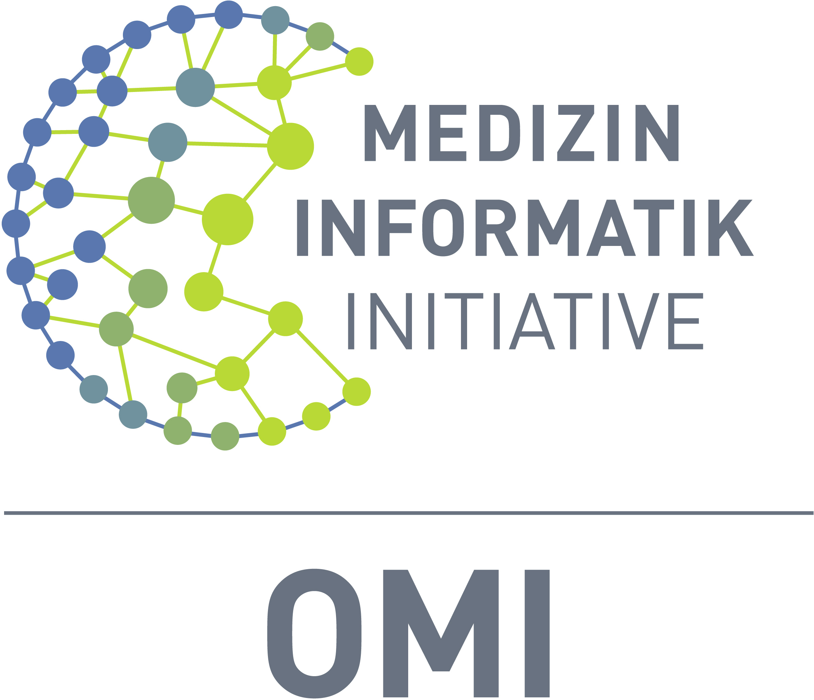

![DICOM-RST Logo[^1]](docs/images/dicom-rst-icon.png)

# DICOM-RST

**DICOMweb-compatible gateway server with DIMSE and S3 implementations.**

[Documentation](https://umessen.github.io/DICOM-RST/usage-guide.html) | [Changelog](./CHANGELOG.md)

---

DICOM-RST is a robust DICOMweb-compatible gateway server that supports QIDO-RS, WADO-RS and STOW-RS independently of the
PACS vendor, ensuring robust and performant transfers of large amounts of imaging data with high parallelism from
multiple PACS to multiple clients.

This project is part of
the [Open Medical Inference](https://www.medizininformatik-initiative.de/de/omi-open-medical-inference) methodology
platform.

The OMI methodology platform aims to
improve the quality of medical diagnoses and treatment decisions by using
artificial intelligence (AI) to simplify time-consuming and repetitive tasks in medicine. To improve medical care, OMI
is developing an open protocol for data exchange on the common framework of the Medical Informatics Initiative (MII).
The project team is also actively involved in the MII interoperability working group.

OMI uses innovative methods to make AI models remotely usable for different hospitals. For example, the project is
creating the technical requirements for a hospital to be able to use the AI of other hospitals to analyze image data -
without having to keep it in its own data center. The semantically interoperable exchange of multimodal healthcare data
is also to be facilitated. OMI is particularly focused on image-based multimodal AI models, which have the potential to
achieve significant progress in the field of medical research and care. Funding is provided by the Federal Ministry of
Education and Research (BMBF).

## Available Backends

DICOM-RST provides multiple backend implementations for the DICOMweb gateway server:

**DIMSE**:
The DIMSE backend translates DICOMweb requests into DIMSE-C messages (e.g. WADO-RS to C-MOVE).
This is the preferred backend for most users due to the broad availability and support of DIMSE services in picture
archiving and communication systems.

**S3**:
The experimental S3 backend downloads DICOM instances from S3-compatible storage. Currently, only the WADO-RS
service is implemented.

## DICOMweb Features

> [!NOTE]  
> Actual support may vary depending on the features implemented by the origin server.

### Retrieve DICOM objects (WADO-RS)

https://www.dicomstandard.org/using/dicomweb/retrieve-wado-rs-and-wado-uri

#### Instance Resources

| Description      | Path                                                   | Support Status |
|------------------|--------------------------------------------------------|:--------------:|
| Study Instances  | `studies/{study}`                                      |       ✅        |
| Series Instances | `studies/{study}/series/{series}`                      |       ✅        |
| Instance         | `studies/{study}/series/{series}/instances/{instance}` |       ✅        |

#### Metadata Resources

❌ Metadata Resources are not supported.

#### Rendered Resources

❌ Rendered Resourced are not supported.

#### Thumbnail Resources

❌ Thumbnail Resources are not supported.

#### Bulkdata Resources

❌ Bulkdata Resources are not supported.

#### Pixel Data Resources

❌ Pixel Data Resources are not supported.

### Search for DICOM objects (QIDO-RS)

https://www.dicomstandard.org/using/dicomweb/query-qido-rs

#### Resources

| Resource                  | URI Template                                           | Support Status |
|---------------------------|--------------------------------------------------------|:--------------:|
| All Studies               | `/studies{?search*}`                                   |       ✅        |
| Study's Series            | `/studies/{study}/series{?search*}`                    |       ✅        |
| Study's Series' Instances | `/studies/{study}/series/{series}/instances{?search*}` |       ✅        |
| Study's Instances         | `/study/{study}/instances{?search*}`                   |       ✅        |
| All Series                | `/series{?search*}`                                    |       ✅        |
| All Instances             | `/instances{?search*}`                                 |       ✅        |

#### Query Parameters

| Key           | Description                             | Support Status |
|---------------|-----------------------------------------|:--------------:|
| {attributeID} | Query matching on supplied value        |       ✅        |
| includefield  | Include supplied tags in result         |       ✅        |
| fuzzymatching | Whether query should use fuzzy matching |       ❌        |
| limit         | Return only {n} results                 |       ✅        |
| offset        | Skip {n} results                        |       ✅        |

### Store DICOM objects (STOW-RS)

https://www.dicomstandard.org/using/dicomweb/store-stow-rs

#### Resources

| Resource | URI Template       | Support Status |
|----------|--------------------|:--------------:|
| Studies  | `/studies`         |       ✅        |
| Study    | `/studies/{study}` |       ❌        |

### Manage worklist items (UPS-RS)

https://www.dicomstandard.org/using/dicomweb/workflow-ups-rs

❌ UPS-RS is not supported.

## DICOM-RST Features

DICOM-RST provides additional features that are not part of the DICOMweb specification.

### AET list

Returns a list of configured AETs.

| Resource | URI Template |
|----------|--------------|
| AET List | `/aets`      |

### Health Check

Returns a simple OK if the connection is still healthy.

| Resource     | URI Template   |
|--------------|----------------|
| Health Check | `/aets/{aets}` |

[^1]: The [DICOM-RST logo](./dicom-rst-icon.png) is adapted from
the [Rust logo](https://github.com/rust-lang/rust-artwork)
owned by the Rust Foundation, used under CC-BY.