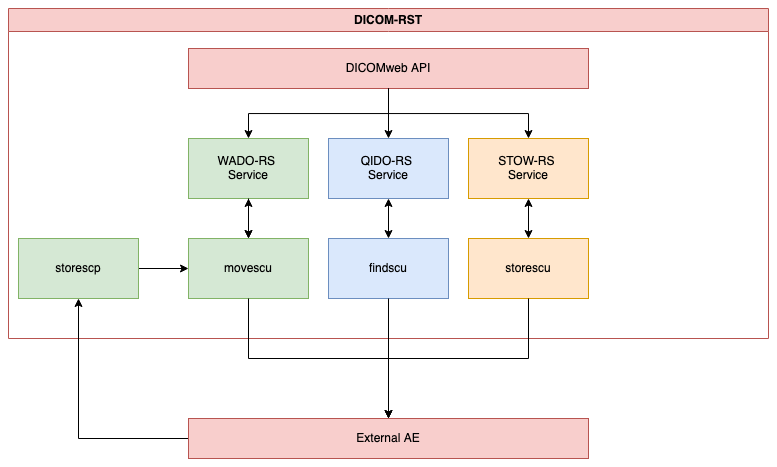
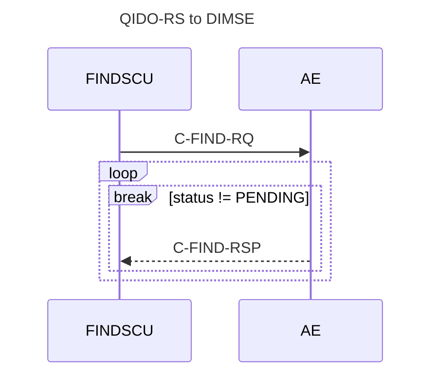
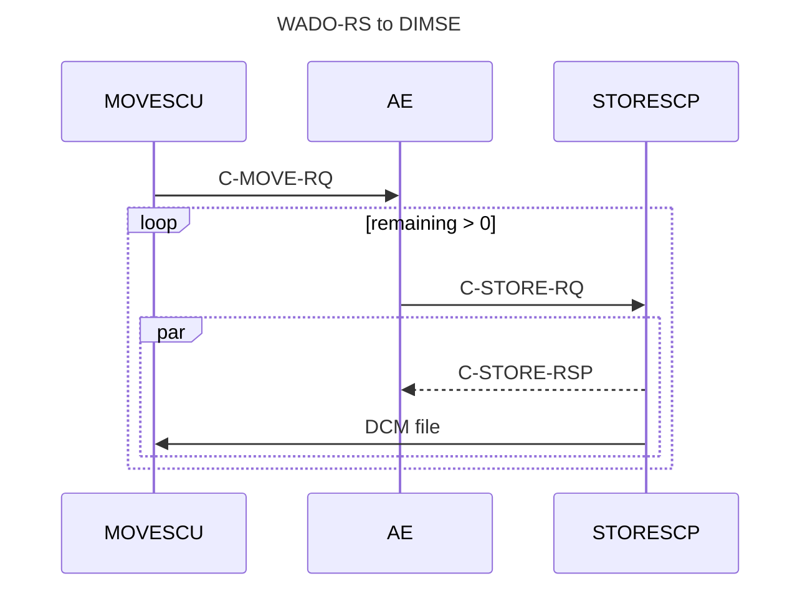
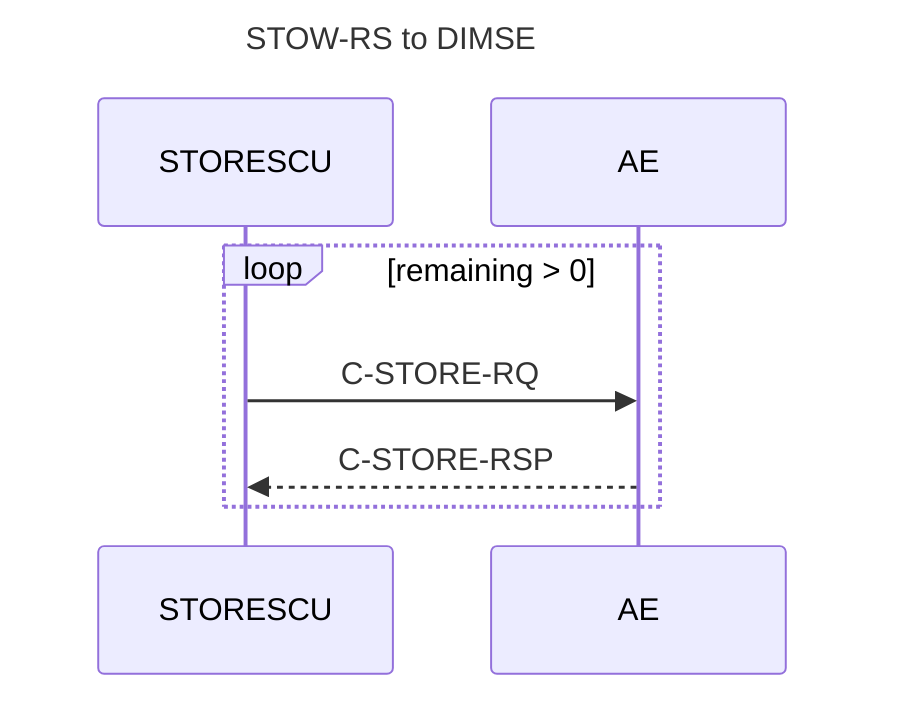

# DIMSE backend

## QIDO-RS

```mermaid

sequenceDiagram
    title QIDO-RS to DIMSE
    FINDSCU ->> AE: C-FIND-RQ
    loop
        break status != PENDING
            AE -->> FINDSCU: C-FIND-RSP
        end
    end

```

## WADO-RS

```mermaid
sequenceDiagram
    title WADO-RS to DIMSE
    MOVESCU ->> AE: C-MOVE-RQ
    loop remaining > 0
        AE ->> STORESCP: C-STORE-RQ
        par
            STORESCP -->> AE: C-STORE-RSP
            STORESCP ->> MOVESCU: DCM file
        end
    end
```

## STOW-RS

```mermaid
sequenceDiagram
    title STOW-RS to DIMSE

    loop remaining > 0
        STORESCU ->> AE: C-STORE-RQ
        AE -->> STORESCU: C-STORE-RSP
    end
```