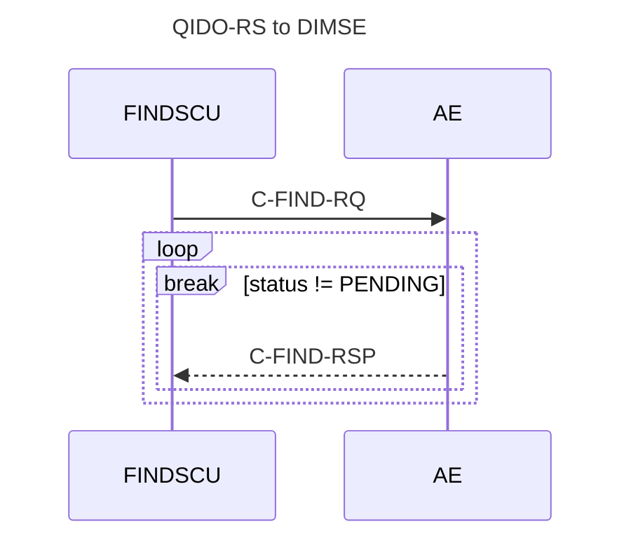
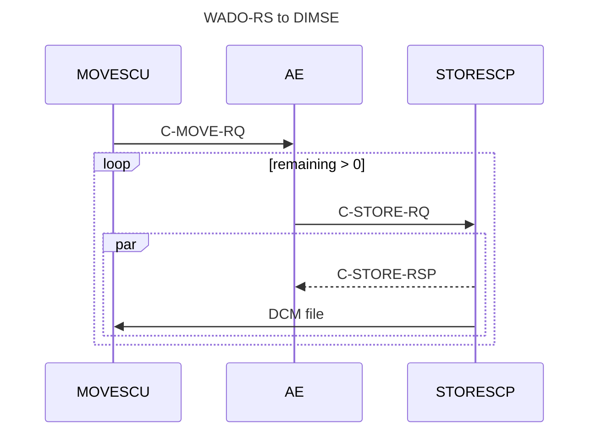
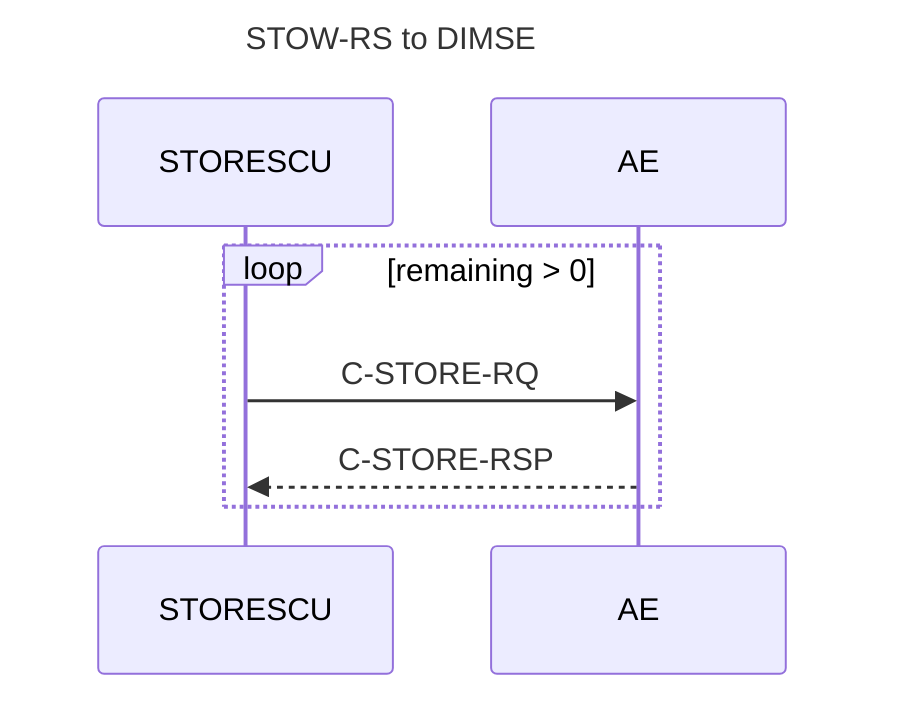

# DIMSE Backend

The DIMSE-Backend for DICOM-RST implements a subset of
the [DICOMweb standard](https://www.dicomstandard.org/using/dicomweb) by translating requests to
[DIMSE-C](https://dicom.nema.org/medical/dicom/current/output/chtml/part07/sect_7.5.html) messages.

It depends on the availability of the following DIMSE-C services:

- `C-MOVE`
- `C-FIND`
- `C-STORE`

## Query Service

[https://www.dicomstandard.org/using/dicomweb/query-qido-rs](https://www.dicomstandard.org/using/dicomweb/query-qido-rs)

The Query Service (QIDO-RS) is implemented as a Service Class User (SCU) for the Query/Retrieve service class.

### Requirements

The following SOP classes MUST be supported by the called Application Entity.

| SOP UID                     | SOP Name                                           |
|-----------------------------|----------------------------------------------------|
| 1.2.840.10008.5.1.4.1.2.2.1 | Study Root Query/Retrieve Information Model – FIND |

### Resources {id="resources_1"}

| Resource                  | URI Template                                           | Support Status |
|---------------------------|--------------------------------------------------------|:--------------:|
| All Studies               | `/studies{?search*}`                                   |       ✅        |
| Study's Series            | `/studies/{study}/series{?search*}`                    |       ✅        |
| Study's Series' Instances | `/studies/{study}/series/{series}/instances{?search*}` |       ✅        |
| Study's Instances         | `/study/{study}/instances{?search*}`                   |       ✅        |
| All Series                | `/series{?search*}`                                    |       ✅        |
| All Instances             | `/instances{?search*}`                                 |       ✅        |

### Query Parameters

| Key           | Description                             | Support Status |
|---------------|-----------------------------------------|:--------------:|
| {attributeID} | Query matching on supplied value        |       ✅        |
| includefield  | Include supplied tags in result         |       ✅        |
| fuzzymatching | Whether query should use fuzzy matching |       ❌        |
| limit         | Return only {n} results                 |       ✅        |
| offset        | Skip {n} results                        |       ✅        |

## Retrieve Service

[https://www.dicomstandard.org/using/dicomweb/retrieve-wado-rs-and-wado-uri](https://www.dicomstandard.org/using/dicomweb/retrieve-wado-rs-and-wado-uri)

### Requirements {id="wado_requirements"}

The following SOP classes MUST be supported by the called Application Entity.

| SOP UID                     | SOP Name                                           |
|-----------------------------|----------------------------------------------------|
| 1.2.840.10008.5.1.4.1.2.2.2 | Study Root Query/Retrieve Information Model – MOVE |

### Instance Resources

| Description      | Path                                                   | Support Status |
|------------------|--------------------------------------------------------|:--------------:|
| Study Instances  | `studies/{study}`                                      |       ✅        |
| Series Instances | `studies/{study}/series/{series}`                      |       ✅        |
| Instance         | `studies/{study}/series/{series}/instances/{instance}` |       ✅        |

### Metadata Resources

Metadata Resources are not supported.

### Rendered Resources

Rendered Resourced are not supported.

### Thumbnail Resources

Thumbnail Resources are not supported.

### Bulkdata Resources

Bulkdata Resources are not supported.

### Pixel Data Resources

Pixel Data Resources are not supported.

## Store Service

[https://www.dicomstandard.org/using/dicomweb/store-stow-rs](https://www.dicomstandard.org/using/dicomweb/store-stow-rs)

### Resources

| Resource | URI Template       | Support Status |
|----------|--------------------|:--------------:|
| Studies  | `/studies`         |       ✅        |
| Study    | `/studies/{study}` |       ❌        |

